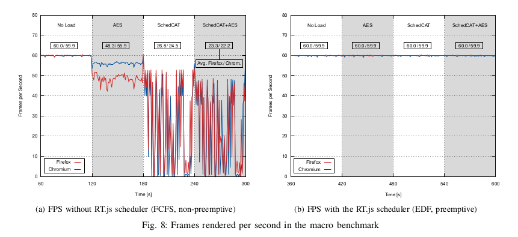

# RT.js: Practical Real-Time Scheduling for Web Applications

RT.js is a framework that provides preemptive and prioritized scheduling of JavaScript jobs. JavaScript interpreters run as a single processor with a run-to-completion semantics. Every event handler in JavaScript is a job to the execution engine, which is run until it is done, with no way of yielding the execution engine for a job, which is more important or for rendering the web-page. In fact a JavaScript event handler may busy wait on something and starve all other jobs, including the renderer of the web browser.



RT.js resolves that automatically by transpiling (i.e. source-to-source compiling) the JavaScript code and adding preemption points to the code. RT.js jobs are run through the scheduler, which checks the time budgets for the jobs when they hit a preemption point (i.e. return to the scheduler). The scheduler may resume execution, schedule a different job (with a higher priority) or stop JavaScript execution alltogether, so the browser may decide what to do next.

The transpiler converts every function marked with the `@rtjs` or `// @rtjs` decorator to a generator function, meaning that the run-time system allows returning from that function prematurely and re-entry into that function. The run-time system keeps the state of the function and the local objects. Preemption points are added by inserting `yield`-statements on the following occasions:

- before `while` and `for` loop bodies, i.e. on every iteration of the loop
- before function calls
- before `if` statements

Both [Mozilla][2] and [Google][1] suggest either not using the main-thread (i.e. creating web workers for complex computations, with their own drawbacks) or splitting up the computations on the main thread. RT.js does that automatically and allows you to prioritize your work load. Compute intensive tasks can be offloaded to be executed when the RT.js scheduler runs next, whereas small event handlers can still be run without using the services of RT.js.

## Conference Publication at RTSS 2019

> [RT.js: Practical Real-Time Scheduling for Web Applications](https://www.sra.uni-hannover.de/Publications/publications.html#dietrich:19:rtss). Christian Dietrich, Stefan Naumann, Robin Thrift, Daniel Lohmann. Proceedings of the 40th IEEE Real-Time Systems Symposium 2019. IEEE Computer Society Press. 2019

## Project Directory Structure

- `src` contains the main source files for the runtime and transpiler (source to source compiler).
- `src/transpiler` contains the transpiler code.
- `benchmarks` contains a number of benchmarks of different kinds.
  - `benchmarks/qualitative` is the macro benchmark from the RTSS publication. It contains a website running in a browser showcasing RT.js against the default run-to-completion policy of the JavaScript run-time engine. (you'll need `plotly-base` to use that benchmark)
  - `benchmarks/minimal` contains a small example project that uses RT.js to introduce pseudo-preemptivity.

After building the transpiler (see below), the `build`-folder exists, containing the transpiled RT.js library and the transpiler, ready for use.

## Installation and Setup

- `npm install`: Install all required dependencies (especially TypeScript).
- `make build`: Build the RT.js transpiler. Please note: The benchmarks will build the transpiler as an dependency.
- `make docs`: Generate a browsable version of the API docs in ./docs

## Basic Usage

To allow for scheduling all tasks must inherit from the `Task`-class and override the `run`-method:

```javascript
import { Task } from "Task"

class MyTask extends Task {
    // @rtjs
    *run() {
        var i = 0;
        while (i < 1000000) {
           i++;
        }
        // implement your task here
    }
}
```

Note that every method that should be transformed needs to be prefixed by the `@rtjs`-decorator. Functions can also be made schedulable and preemtible by simply prefixing them with the same `@rtjs`-decorator (or inside a comment for pure JavaScript `// @rtjs`).

To transpile the code use the `rtjs-transpiler.js` tool in `build/transpiler`, e.g.:

```
build/transpiler/rtjs-transpiler "MyTask.js"
cat build/MyTask.js
```

> NOTE: Currently the output directory is always `build`

[1]: https://developers.google.com/web/fundamentals/performance/rendering/ "Rendering Performance: Google"
[2]: https://developer.mozilla.org/en-US/docs/Mozilla/Firefox/Performance_best_practices_for_Firefox_fe_engineers "Performance best practices for Firefox front-end engineers"
